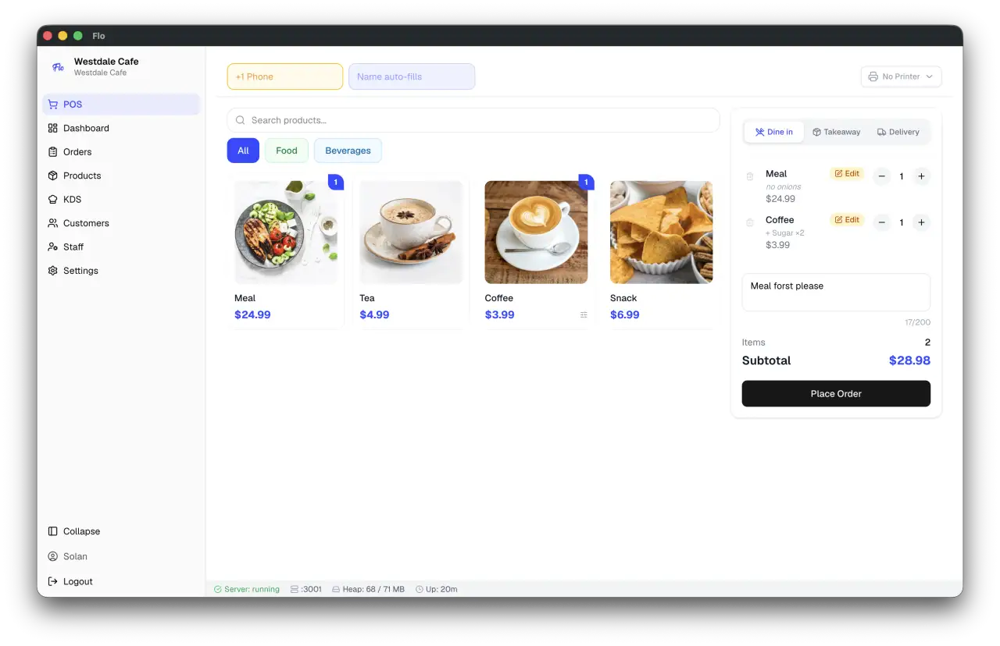

<div align="center">
  <h1>Aromatic</h1>
  <p><a href="README.es.md">Español</a> · <a href="README.pt.md">Português</a> · <a href="README.fr.md">Français</a> · <a href="README.tr.md">Türkçe</a> · <a href="README.fil.md">Filipino</a> · <a href="README.de.md">Deutsch</a> · <a href="README.zh-CN.md">简体中文</a> · <a href="README.ar.md">العربية</a> · <a href="README.ur.md">اردو</a></p>
  <p><strong>Free, open-source, offline-first point of sale for cafés, restaurants, and small kitchens.</strong></p>

</div>

<p align="center">
  
</p>

Aromatic runs directly on the business's own computer. Orders, customers, receipts, and backups are stored in a local SQLite database, allowing counter service and kitchen displays to continue operating without an internet connection. No hosted or cloud account is required for core POS operation. Optional integrations—such as Google Drive backup, WhatsApp bill delivery, and cloud-connected reporting—can be enabled when needed.

Releases include Windows installers, macOS DMGs, and Linux AppImage, `.deb`,
`.rpm`, and Snap packages. For Linux package-specific installation and update
behavior, FUSE setup, printing permissions, and tray behavior, see [Linux
installation and support](docs/linux.md).

### System requirements

| Requirement | Minimum |
| --- | --- |
| Operating system | Windows 10+, macOS 12+, or a current supported Linux distribution |
| Memory | 4 GB RAM |
| Storage | 500 MB free space, plus room for local backups |

Node.js is only required to develop Aromatic, not to run a packaged release.

<details>
<summary>Uninstall a direct-download build</summary>

App Store and Microsoft Store installs should be removed through the relevant store or operating system.

```sh
# macOS
curl -fsSL https://github.com/FreeOpenSourcePOS/Aromatic/releases/latest/download/uninstall-macos.sh -o uninstall-macos.sh
chmod +x uninstall-macos.sh
./uninstall-macos.sh
```

```powershell
# Windows PowerShell
irm https://github.com/FreeOpenSourcePOS/Aromatic/releases/latest/download/uninstall-windows.ps1 -OutFile uninstall-windows.ps1
powershell -ExecutionPolicy Bypass -File .\uninstall-windows.ps1
```

Both scripts ask whether to keep application data. Do not choose their data-purge options unless you intend to remove the local database and backups.

</details>

## Highlights

- **Order workflows:** Counter, dine-in, takeaway, and delivery orders with table management and held orders.
- **Modifiers & pricing:** Item modifiers, add-on groups, discounts, and customer loyalty points.
- **Receipt printing:** ESC/POS thermal printing over USB, local network (TCP), and OS-managed print queues, with WebUSB supported in compatible browsers (58 mm and 80 mm paper support).
- **Kitchen operations:** Standalone Kitchen Display System (KDS) server and category-based kitchen station routing.
- **Catalog management:** Product images, barcode scanning, and CSV menu import/export.
- **Administration:** Role-based staff accounts (Owner, Manager, Cashier, Server, Chef), sales analytics, and audit logs.
- **Data protection:** Local SQLite database with automated pre-migration backups, manual restore tools, and optional Google Drive backup.

## Project status

Aromatic is actively developed and already used in real deployments. Core customer data and upgrade safety are treated carefully, including explicit database migrations and recovery mechanisms. Some internal and extension-facing architecture is still evolving, so implementation details and internal contracts may change as the project matures.

## Offline-first by design

Core POS operation and local data are offline-first. Order entry, billing, KDS coordination, and receipt printing do not depend on internet access or external cloud services.

- **Data location:** The SQLite database and local backups reside in the operating system user-data directory, separate from installed application binaries. Standard in-place application updates do not remove them. As a best practice, create a manual backup before reinstalling, moving to a new machine, or changing distribution channels.
- **Pre-migration backups:** Aromatic automatically creates a timestamped database backup before running schema migrations.
- **Optional network features:** Services such as Google Drive backups, WhatsApp bill delivery, and cloud reporting communicate over the network only when explicitly configured and enabled by the store owner.

## Languages and regional support

Aromatic includes UI translations for:

- English
- Spanish
- French
- Brazilian Portuguese
- Russian
- Filipino
- Turkish
- Persian (Farsi), including RTL support
- Arabic, including RTL support
- Urdu, including RTL support
- German
- Italian
- Japanese
- Simplified Chinese
- Traditional Chinese (Taiwan)
- Korean
- Bahasa Indonesia
- Dutch
- Hindi
- Bengali/Bangla
- Albanian
- Vietnamese
- Thai
- Nepali

UI language is independent of store country and regional settings, and tax calculation rules remain a separate concern. For details on contributing translations or adding languages, see the [Internationalization and translation guide](docs/architecture/internationalization.md).

Aromatic ships with 131 country profiles covering 109 currencies. Each profile sets a default currency, locale, and setup timezone; store owners can override the timezone during setup or later in Settings.

<details>
<summary>Supported country profiles, currencies, and default timezones</summary>

| Country | Currency | Default timezone |
| --- | --- | --- |
| India (IN) | INR | Asia/Kolkata |
| Argentina (AR) | ARS | America/Argentina/Buenos_Aires |
| United States (US) | USD | America/New_York |
| Canada (CA) | CAD | America/Toronto |
| United Kingdom (GB) | GBP | Europe/London |
| Thailand (TH) | THB | Asia/Bangkok |
| Singapore (SG) | SGD | Asia/Singapore |
| Malaysia (MY) | MYR | Asia/Kuala_Lumpur |
| Indonesia (ID) | IDR | Asia/Jakarta |
| Philippines (PH) | PHP | Asia/Manila |
| Vietnam (VN) | VND | Asia/Ho_Chi_Minh |
| Australia (AU) | AUD | Australia/Sydney |
| New Zealand (NZ) | NZD | Pacific/Auckland |
| United Arab Emirates (AE) | AED | Asia/Dubai |
| Saudi Arabia (SA) | SAR | Asia/Riyadh |
| South Africa (ZA) | ZAR | Africa/Johannesburg |
| Morocco (MA) | MAD | Africa/Casablanca |
| Kenya (KE) | KES | Africa/Nairobi |
| Nigeria (NG) | NGN | Africa/Lagos |
| Brazil (BR) | BRL | America/Sao_Paulo |
| Mexico (MX) | MXN | America/Mexico_City |
| Chile (CL) | CLP | America/Santiago |
| Uruguay (UY) | UYU | America/Montevideo |
| Paraguay (PY) | PYG | America/Asuncion |
| Japan (JP) | JPY | Asia/Tokyo |
| South Korea (KR) | KRW | Asia/Seoul |
| China (CN) | CNY | Asia/Shanghai |
| Hong Kong SAR China (HK) | HKD | Asia/Hong_Kong |
| Taiwan (TW) | TWD | Asia/Taipei |
| Pakistan (PK) | PKR | Asia/Karachi |
| Bangladesh (BD) | BDT | Asia/Dhaka |
| Sri Lanka (LK) | LKR | Asia/Colombo |
| Nepal (NP) | NPR | Asia/Kathmandu |
| Egypt (EG) | EGP | Africa/Cairo |
| Israel (IL) | ILS | Asia/Jerusalem |
| Türkiye (TR) | TRY | Europe/Istanbul |
| Iran (IR) | IRR | Asia/Tehran |
| Germany (DE) | EUR | Europe/Berlin |
| France (FR) | EUR | Europe/Paris |
| Italy (IT) | EUR | Europe/Rome |
| Spain (ES) | EUR | Europe/Madrid |
| Portugal (PT) | EUR | Europe/Lisbon |
| Netherlands (NL) | EUR | Europe/Amsterdam |
| Belgium (BE) | EUR | Europe/Brussels |
| Ireland (IE) | EUR | Europe/Dublin |
| Austria (AT) | EUR | Europe/Vienna |
| Greece (GR) | EUR | Europe/Athens |
| Finland (FI) | EUR | Europe/Helsinki |
| Luxembourg (LU) | EUR | Europe/Luxembourg |
| Malta (MT) | EUR | Europe/Malta |
| Cyprus (CY) | EUR | Asia/Nicosia |
| Slovakia (SK) | EUR | Europe/Bratislava |
| Slovenia (SI) | EUR | Europe/Ljubljana |
| Estonia (EE) | EUR | Europe/Tallinn |
| Latvia (LV) | EUR | Europe/Riga |
| Lithuania (LT) | EUR | Europe/Vilnius |
| Croatia (HR) | EUR | Europe/Zagreb |
| Switzerland (CH) | CHF | Europe/Zurich |
| Sweden (SE) | SEK | Europe/Stockholm |
| Norway (NO) | NOK | Europe/Oslo |
| Denmark (DK) | DKK | Europe/Copenhagen |
| Poland (PL) | PLN | Europe/Warsaw |
| Czechia (CZ) | CZK | Europe/Prague |
| Hungary (HU) | HUF | Europe/Budapest |
| Romania (RO) | RON | Europe/Bucharest |
| Bulgaria (BG) | BGN | Europe/Sofia |
| Iceland (IS) | ISK | Atlantic/Reykjavik |
| Serbia (RS) | RSD | Europe/Belgrade |
| Ukraine (UA) | UAH | Europe/Kyiv |
| Albania (AL) | ALL | Europe/Tirane |
| North Macedonia (MK) | MKD | Europe/Skopje |
| Bosnia & Herzegovina (BA) | BAM | Europe/Sarajevo |
| Moldova (MD) | MDL | Europe/Chisinau |
| Georgia (GE) | GEL | Asia/Tbilisi |
| Armenia (AM) | AMD | Asia/Yerevan |
| Azerbaijan (AZ) | AZN | Asia/Baku |
| Qatar (QA) | QAR | Asia/Qatar |
| Kuwait (KW) | KWD | Asia/Kuwait |
| Bahrain (BH) | BHD | Asia/Bahrain |
| Oman (OM) | OMR | Asia/Muscat |
| Jordan (JO) | JOD | Asia/Amman |
| Lebanon (LB) | LBP | Asia/Beirut |
| Iraq (IQ) | IQD | Asia/Baghdad |
| Yemen (YE) | YER | Asia/Aden |
| Ghana (GH) | GHS | Africa/Accra |
| Tanzania (TZ) | TZS | Africa/Dar_es_Salaam |
| Uganda (UG) | UGX | Africa/Kampala |
| Ethiopia (ET) | ETB | Africa/Addis_Ababa |
| Rwanda (RW) | RWF | Africa/Kigali |
| Côte d’Ivoire (CI) | XOF | Africa/Abidjan |
| Senegal (SN) | XOF | Africa/Dakar |
| Cameroon (CM) | XAF | Africa/Douala |
| Zambia (ZM) | ZMW | Africa/Lusaka |
| Mauritius (MU) | MUR | Indian/Mauritius |
| Tunisia (TN) | TND | Africa/Tunis |
| Algeria (DZ) | DZD | Africa/Algiers |
| Botswana (BW) | BWP | Africa/Gaborone |
| Namibia (NA) | NAD | Africa/Windhoek |
| Mozambique (MZ) | MZN | Africa/Maputo |
| Angola (AO) | AOA | Africa/Luanda |
| Kazakhstan (KZ) | KZT | Asia/Almaty |
| Uzbekistan (UZ) | UZS | Asia/Tashkent |
| Mongolia (MN) | MNT | Asia/Ulaanbaatar |
| Myanmar (Burma) (MM) | MMK | Asia/Yangon |
| Cambodia (KH) | KHR | Asia/Phnom_Penh |
| Laos (LA) | LAK | Asia/Vientiane |
| Brunei (BN) | BND | Asia/Brunei |
| Macao SAR China (MO) | MOP | Asia/Macau |
| Maldives (MV) | MVR | Indian/Maldives |
| Bhutan (BT) | BTN | Asia/Thimphu |
| Afghanistan (AF) | AFN | Asia/Kabul |
| Guatemala (GT) | GTQ | America/Guatemala |
| Costa Rica (CR) | CRC | America/Costa_Rica |
| Panama (PA) | PAB | America/Panama |
| Dominican Republic (DO) | DOP | America/Santo_Domingo |
| Honduras (HN) | HNL | America/Tegucigalpa |
| El Salvador (SV) | USD | America/El_Salvador |
| Nicaragua (NI) | NIO | America/Managua |
| Belize (BZ) | BZD | America/Belize |
| Jamaica (JM) | JMD | America/Jamaica |
| Trinidad & Tobago (TT) | TTD | America/Port_of_Spain |
| Bahamas (BS) | BSD | America/Nassau |
| Barbados (BB) | BBD | America/Barbados |
| Haiti (HT) | HTG | America/Port-au-Prince |
| Bolivia (BO) | BOB | America/La_Paz |
| Ecuador (EC) | USD | America/Guayaquil |
| Colombia (CO) | COP | America/Bogota |
| Peru (PE) | PEN | America/Lima |
| Venezuela (VE) | VES | America/Caracas |
| Fiji (FJ) | FJD | Pacific/Fiji |
| Papua New Guinea (PG) | PGK | Pacific/Port_Moresby |

</details>

## Tax support

Aromatic includes a generic calculation engine and supports signed, versioned country tax packs for regional rules, tax categories, and rounding policies. Country coverage is expanding through the catalog, and availability varies. Operators can also configure manual tax rules and rates locally.

> **Notice:** Aromatic is software, not legal or tax advice. Tax packs and configuration tools do not by themselves certify compliance with local regulations. Operators remain responsible for verifying the requirements that apply to their business.

For pack authoring, validation, and schema details, see the [Tax packs developer guide](docs/reference/tax-packs.md).

## Development

Setting up a local development environment requires Node.js 22 or later:

```sh
git clone https://github.com/FreeOpenSourcePOS/Aromatic.git
cd Aromatic
npm install
npm run dev
```

`npm run dev` builds the frontend and backend, then launches Electron.

### Architecture

```text
Electron main process
├── Express API and WebSocket server       :3001
├── Standalone kitchen-display server      :3002
├── Server / waiter app server             :3003
└── SQLite database, migrations, and printing
                 ↕ HTTP and WebSocket
Next.js renderer
└── React UI and Zustand client state
```

For detailed developer workflows, coding standards, branch conventions, and testing procedures, see [CONTRIBUTING.md](CONTRIBUTING.md).

## Contributing

Contributions are welcome. Please check [CONTRIBUTING.md](CONTRIBUTING.md) before starting work:

- **Small bug fixes, documentation improvements, and focused tests** can be started freely.
- **New features, database schema changes, and architectural refactors** require maintainer discussion and approval before implementation.

If Aromatic is useful to you, consider starring the repository.

## Help and documentation

- **Documentation index:** [docs/README.md](docs/README.md)
- **Printer guide & troubleshooting:** [docs/printers.md](docs/printers.md)
- **Linux setup & support:** [docs/linux.md](docs/linux.md)
- **Internationalization & translations:** [docs/architecture/internationalization.md](docs/architecture/internationalization.md)
- **Google Drive backup setup:** [docs/google-drive-setup.md](docs/google-drive-setup.md)
- **Bug reports & feature proposals:** [GitHub Issues](https://github.com/FreeOpenSourcePOS/Aromatic/issues)
- **General questions & ideas:** [GitHub Discussions](https://github.com/FreeOpenSourcePOS/Aromatic/discussions)

## License

Aromatic is open-source software licensed under the [MIT License](LICENSE).
